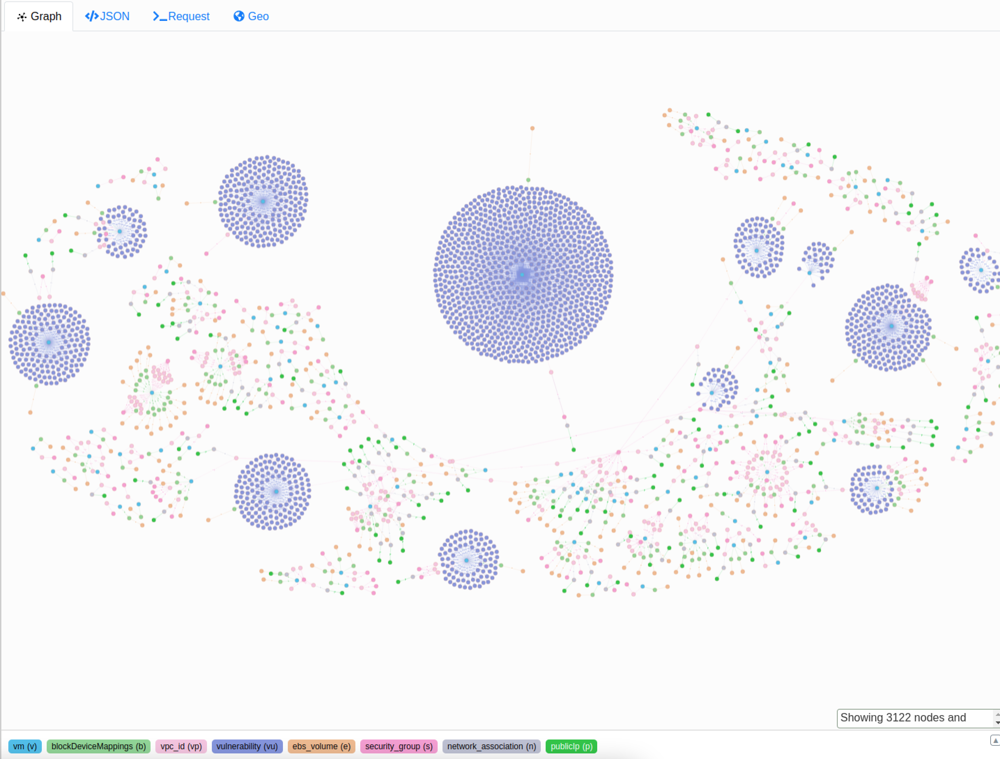
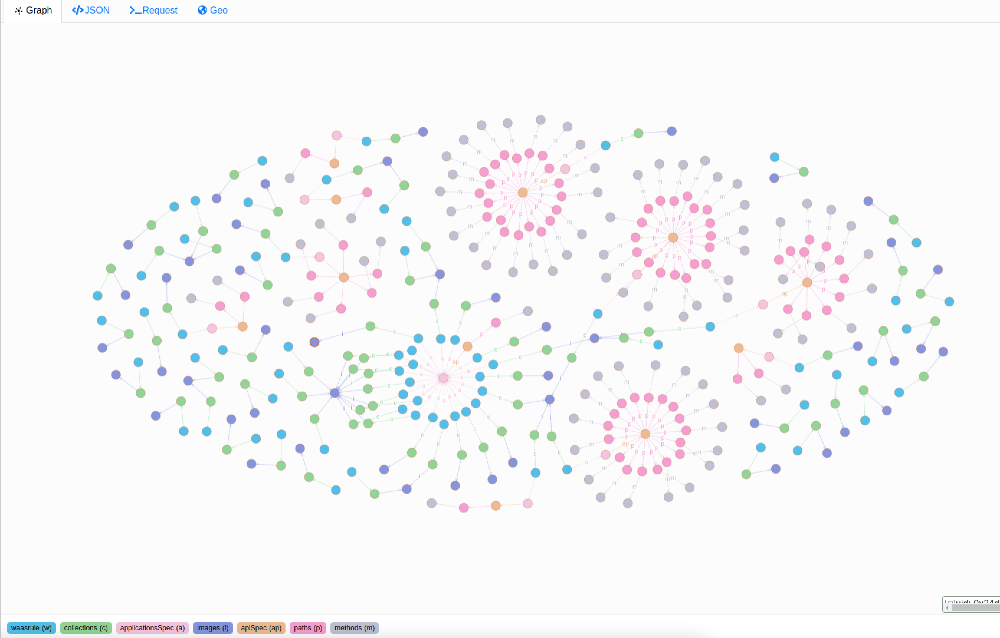

# PC-Graph
[](https://www.codefactor.io/repository/github/kyle9021/pc-graph)

An open-source project built on [Dgraph](https://github.com/dgraph-io/dgraph)

Pulls from the [Prisma Cloud API](https://prisma.pan.dev/) all the aws ec2 instances and the following associated data points:

* vulnerablities
* public ip addresses
* security groups
* vpcs
* ebs volumes
* iam permissions
* and more

Allows you to visualize and explore the data through a GraphQL interface with a backend Graph database. 



non-prod ready

* Deployed on Ubuntu 20.04 desktop 
* Requires jq, docker-compose, curl, bash, and docker


## Setup:


```bash
git clone https://github.com/kyle9021/pc-graph
cd pc-graph/
bash setup.sh
```

* open browser and go to http://localhost:8001/?local

### WAAS policies as Graph

* If you're interested in understanding the WAAS policies in a graphDB go to http://localhost:8001/?local
* In the left-hand menu click "schema" and then click "bulk edit" on the top of the schema page.
* Check the box "Also drop Schema and Types" and in the text field type `DROP ALL` and click "drop all"
* After the data has been cleared `bash waas_policy_etl.sh`



Above we can see the relationship between collections of assets, WAAS rules, api endpoints, request methods, etc. 


See the [Example writeup](./examples/jq-rdf-bash.md) for a quick tutorial on how this was done. 

For language specific ideas for those looking to collaborate see these links:

* [python](https://dgraph.io/docs/clients/python/)
* [golang](https://dgraph.io/docs/clients/go/)
* [C#](https://dgraph.io/docs/clients/csharp/)
* [JavaScript](https://dgraph.io/docs/clients/javascript/grpc/)


